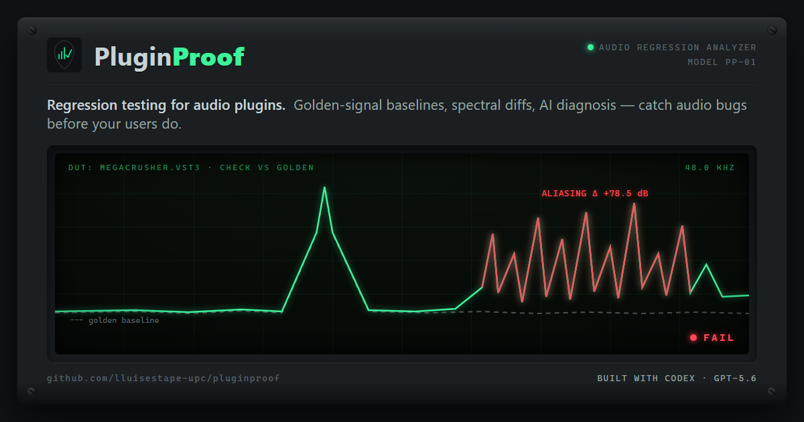

<p align="center">
  
</p>

# PluginProof

**Regression testing for audio plugins — catch audio bugs before your users do.**

Audio plugin developers ship releases tested *by ear*. A refactor compiles fine, sounds
"about right" in a quick A/B… and quietly introduces aliasing at 48 kHz, a 0.5 dB gain
error, or a denormal that spikes CPU. There is no `pytest` for *sound*. PluginProof is
that missing tool: it measures a plugin like a lab instrument, snapshots a **golden
baseline**, and flags any sonic regression on every build — in a desktop app or in CI.

Built for **OpenAI Build Week 2026** (Developer Tools track) with **Codex + GPT-5.6**.

---

## What it measures

Four golden-signal measurements, run through the actual plugin binary (VST3, via
[pedalboard]):

| Metric | Stimulus | Catches |
|---|---|---|
| **Frequency response deviation** | exponential sine sweep → Welch H1 transfer function | broken filter coefficients, tone-stage bugs, gain tilts |
| **THD+N** | 1 kHz sine → least-squares sine fit, residual analysis | saturation/waveshaper changes, gain-staging errors |
| **Aliasing score** | tone at 0.41·Nyquist → energy at non-harmonic image frequencies | missing/bypassed oversampling, naive resampling, quantization |
| **NaN / denormal count** | silence + full-scale extremes | numerical instability, missing denormal flushing |

Each `check` re-measures the plugin from disk and diffs against the golden baseline with
per-metric thresholds → **PASS / WARN / FAIL** (exit codes 0/1/2, CI-ready), plus a
self-contained HTML report with baseline-vs-current spectrum overlays.

## AI diagnosis (bring your own key)

Numbers say *what* regressed; the AI panel says *why*. The metric diffs are handed to a
model that answers like a DSP engineer: *"severe aliasing above 15 kHz — check your
oversampling stage."*

- **GPT-5.6** (default, OpenAI API)
- **Claude** (Anthropic API)
- **Ollama** (100 % local and free — e.g. `llama3.2`; great for CI where per-run API
  calls don't make sense)
- **Rule-based offline fallback** — the tool never breaks without a key or a connection

All three providers speak the OpenAI-compatible API, so it's one code path. The report
honestly labels which engine produced each diagnosis.

## Quick start

**Desktop app (no install):** grab `PluginProof.exe` from the
[latest release](https://github.com/lluisestape-upc/pluginproof/releases) — drop a
`.vst3` on the screen, **Set Golden**, then **Check** after every build. AI provider is
configurable from the ⚙ service panel.

**CLI / CI:**

```bash
pip install -e .

pluginproof baseline "C:\Program Files\Common Files\VST3\MyPlugin.vst3"   # snapshot golden
pluginproof check    "C:\Program Files\Common Files\VST3\MyPlugin.vst3"   # diff vs golden
# exit 0 = PASS · 1 = WARN · 2 = FAIL  → wire it into any CI
```

No plugin at hand? The repo ships a pure-Python fixture: `pluginproof baseline fixture:biquad`.

## Try the demo (reproduce a caught bug in 60 seconds)

This repo includes two real builds of **MegaCrusher** (my own distortion plugin) and a
committed golden baseline. The buggy build contains a one-line "branchless refactor" of
the bit crusher that accidentally inverted the depth mapping — it compiles, the diff
looks harmless, and it quantizes the output to 4 levels at default settings:

```bash
pluginproof check assets/MegaCrusher_buggy.vst3 --baseline demo_golden.json --report report.html
```

Result: **FAIL** — freq response Δ +43.3 dB, THD+N Δ +19.0 dB, aliasing Δ +19.6 dB —
with the spectral evidence and the AI's explanation in `report.html`. The healthy build
(`assets/MegaCrusher_good.vst3`) passes the same check clean.

## CI gate

[.github/workflows/pluginproof.yml](.github/workflows/pluginproof.yml) runs
`pluginproof check` on every pull request against a committed golden
(`ci/golden-biquad.json`). A PR that regresses audio fails in under two minutes — no
human listening required.

## Architecture

```
signals.py        deterministic test-signal generators (sweep, multitone, HF tone, extremes)
measurements.py   the 4 metrics (numpy/scipy; no false positives — deterministic pipeline)
host.py           plugin loading: pedalboard VST3 host · WAV in/out fallback · Python fixtures
baseline.py       golden JSON snapshots · threshold diff engine · verdicts
diagnose.py       BYOK AI layer (OpenAI / Anthropic / Ollama / rules) — engine-labelled
report.py         self-contained HTML report, spectrum overlays (matplotlib, base64)
cli.py            typer CLI (baseline / check, exit codes for CI)
gui.py            pywebview desktop app — drag & drop, Set Golden / Check, service panel
```

Everything is deterministic end-to-end (seeded phases, fixed stimuli), so an unchanged
plugin diffs to exactly zero — zero flaky CI.

## How Codex & GPT-5.6 were used

**GPT-5.6 in the product:** the default diagnosis engine. It receives the structured
metric diffs and run context and turns them into an actionable, plain-language
explanation for the developer. The provider layer, prompt, and offline fallback are in
[pluginproof/diagnose.py](pluginproof/diagnose.py).

**Codex in the workflow** (the core of this build happened in a Codex session — Session
ID submitted via the Devpost form):

- The **desktop app**: pywebview shell, native drag-and-drop (including diagnosing that
  pywebview only exposes dropped-file paths through its Python-side DOM events), the
  re-measure-on-Check flow, and the settings service panel.
- The **BYOK diagnosis layer**: one OpenAI-compatible code path for three providers,
  config persistence, engine labelling.
- **Real-world VST3 hardening**: stereo/mono adaptation, parameter surfaces, keeping all
  pedalboard renders on a single worker thread (VST3 thread affinity on Windows).
- **Packaging**: PyInstaller single-file exe with bundle-aware resource lookup and
  collect-all hooks for pedalboard/scipy/matplotlib/webview.
- **CI**: the GitHub Actions regression gate.

Other AI tooling assisted around the core: Claude Code agents scaffolded module specs,
tests, and documentation in parallel lanes against a shared data contract, and the
visual identity started from a Gemini (Antigravity) brand pass. Key decisions — the
pedalboard host (avoiding a C++ VST3 SDK host), the deterministic-pipeline requirement,
the 4-metric scope, and BYOK — were made reviewing options with these tools in the loop.

## License

[MIT](LICENSE) © 2026 Lluís Estapé

[pedalboard]: https://github.com/spotify/pedalboard
